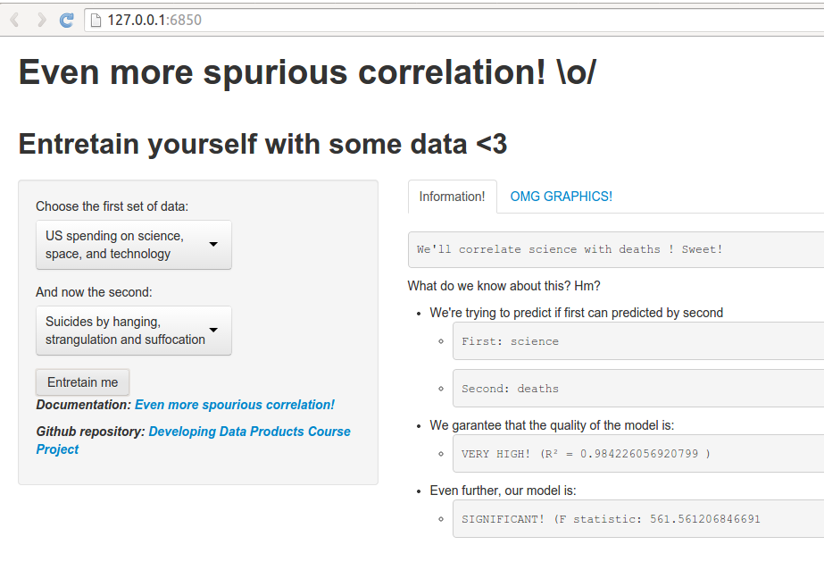

Even More Spourious Correlation!
========================================================
author: Priscilla Kurtz
date: December 17, 2014

Intro & Motivation
========================================================

Data: it's everywhere!

- Wouldn't it be nice to have some application where I can see real data analysis?
- And some graphics?

All this polls and data analysis hidden from the reader is a bad thing.

We would like you to have access to the important numbers that define if a data analysis is really successful.

Even More Spourious Correlation!
========================================================

You choose which data to make a prediction relationship... and voilà!
Simple application, amazing results!



Statistics Involved
========================================================
- <small>R^2 is a measure of the model’s quality. Bigger is better!</small>

```
[1] "GOOD! (R² = 0.651079380758251 )"
```

- <small>The F statistic tells you whether the model is significant or insignificant.</small>

```
[1] "SIGNIFICANT! (F statistic: 89.5671065364677 )"
```

- <small>We also show you the correlation between the sets of data you chose:</small>

```
[1] 0.8069
```
<small><small><small>If the correlation is close to 1, variables are positively linearly related. For -1, variables are negatively linearly. And for zero, it would indicates a weak linear relationship between the variables.</small></small></small>

Conclusion
========================================================

This app is just to elude how everyone without the knowledge of statistics can be mislead with erroneous interpretation of data analysis.
